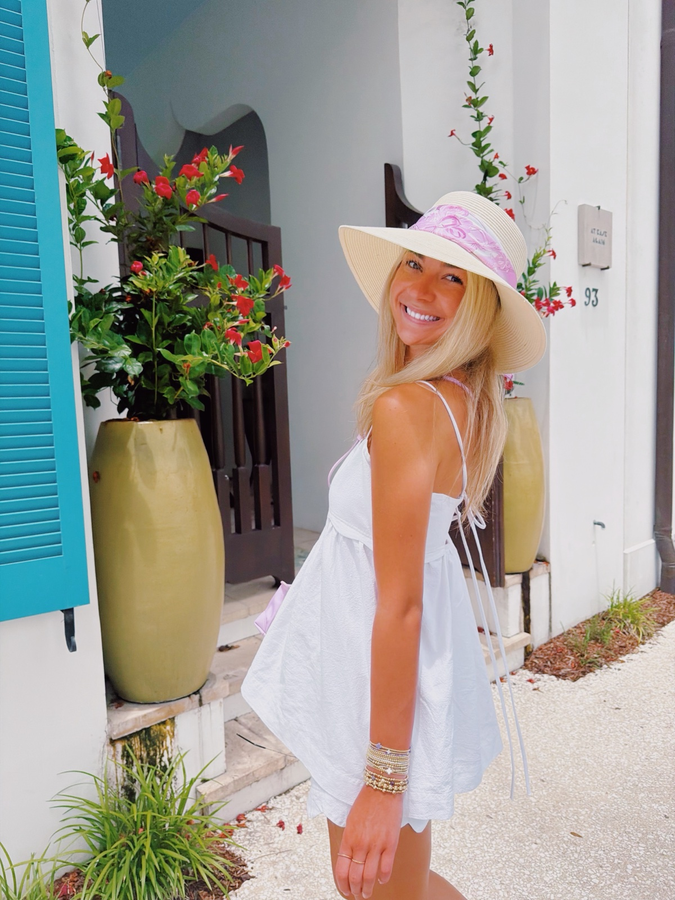

# Elden Brady — Content Portfolio

Single-file portfolio site (`index.html`) inspired by jaydenndouglas.my.canva.site.
No build step, no dependencies — deploys anywhere (Vercel, Netlify, GitHub Pages).

## Preview locally
```bash
cd elden-creator-portfolio
python3 -m http.server 8642
# open http://localhost:8642
```

## Adding Elden's real photos & videos

1. Create an `images/` folder and drop photos in.
2. **About photo (polaroid):** in `index.html`, find the `ph-placeholder` span inside
   `<section class="about">` and replace it with:
   ```html
   
   ```
3. **Content videos:** real TikToks are embedded via TikTok's embed player
   (`.embed-tile` divs with a `data-video="<video id>"` attribute). They lazy-load
   as you scroll; click to play, fullscreen via the TikTok player. To swap a video,
   just change the `data-video` ID (the number at the end of any TikTok URL).
4. **Trusted By carousel:** brand wordmarks in the `.logo-track` div — pulled from
   brands Elden has tagged/partnered with (Lilly Pulitzer, Alo, BUBBL'R, enewton,
   HPU, Printfresh, POETA, Lala Links + ShopMy/LTK/Amazon/Depop). Edit the spans
   (both copies — the list is duplicated for the seamless loop), or replace with
   `` logos ~34px tall. Have Elden confirm the list before publishing.
5. **Shop links:** the four "Shop My World" cards currently point to her Linktree —
   swap in the direct ShopMy / LTK / Amazon Storefront / Depop URLs when she shares them.

## Numbers used (as of July 2026)
- TikTok @elden.brady: 66.2K followers, 17.7M likes
- Instagram @elden.brady: 15.3K followers, 242 posts
- Contact: eldengbrady@gmail.com

Update the hero stats + "By the Numbers" section as these grow.

Note: `~/Downloads/elden-portfolio/` (separate folder) contains an older, different
Elden portfolio (dark editorial / Innovator Insights). It was left untouched.
